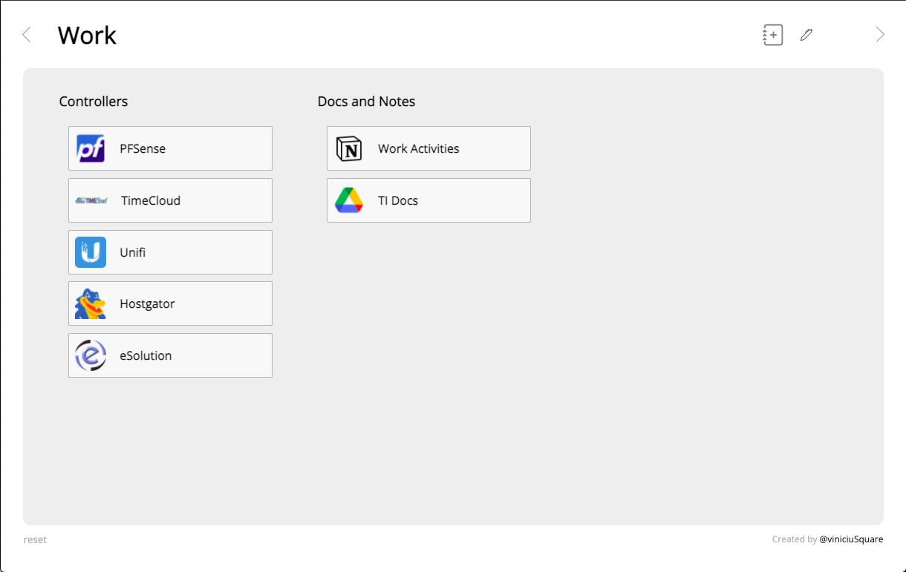

# 📖 Bookmarks

Esta é uma extensão do navegador qual ajuda o usuário a manter seus links preferidos com fácil acesso. Tem a premissa de dividir em categorias chamadas de contexto. 
Links podem ser dispostos agrupados pelos assuntos (título da lista - subject).

Foi desenvolvida por curiosidade no desenvolvimento de extensões e uma necessidade, sendo que os bookmarks nativos não me agradam visualmente e uso inúmeros links no workflow diário, sendo trabalho, estudo da faculdade, de desenvolvimento ou simples enterterimento.

-----
<h4>Visualização dos links salvos</h4>
<p align="center">
	
</p>


----

## 🧊 Persistência de dados

Por ora os dados estão sendo persistido localStorage.

Formato de dados

```json
"context": "Work",
	"data": [
		{
		  "subject": "Docs and Notes",
		  "data": [
		    {
		        "title": "Work Activities",
		        "url": "...",
		        "imageSrc": "./assets/linksIcons/*****.png"
		    },
		    { ... }
		  ]
		}
```

Para cada objeto do modelo acima será montado a view (context) e as listas (subject) com os bookmarks salvos.

---

### ✅ To-do
[x] Criar bookmark
[ ] Editar bookmark
[ ] Personalizar posição e tema
[ ] Navegação entre contextos
[ ] Criar contextos
[ ] Editar contextos
