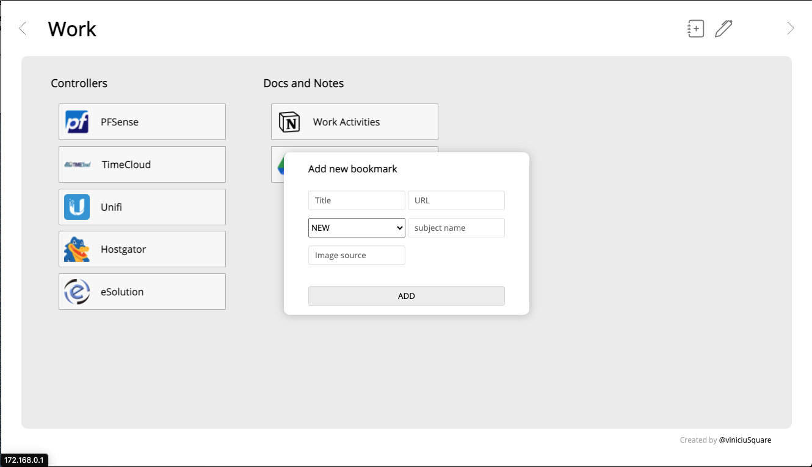

# 📖 Bookmarks

Esta é uma extensão do navegador qual ajuda o usuário a manter seus links preferidos com fácil acesso. Tem a premissa de dividir em categorias chamadas de contexto. 
Links podem ser dispostos agrupados em listas e em contextos.

Foi desenvolvida por curiosidade no desenvolvimento de extensões e uma necessidade, sendo que os bookmarks nativos não me agradam visualmente e uso inúmeros links no workflow diário, sendo trabalho, estudo da faculdade, de desenvolvimento ou simples enterterimento.

-----

----
### ✅ To-do
- Editar bookmarks salvos
- Criar contextos diferentes
- Personalizar posição e tema